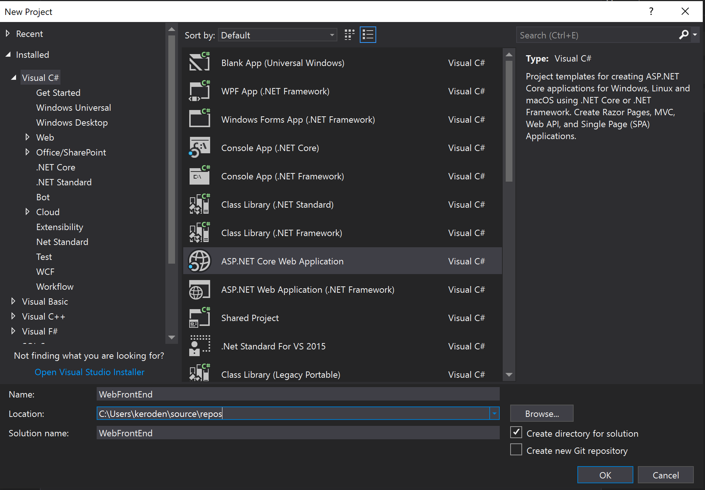
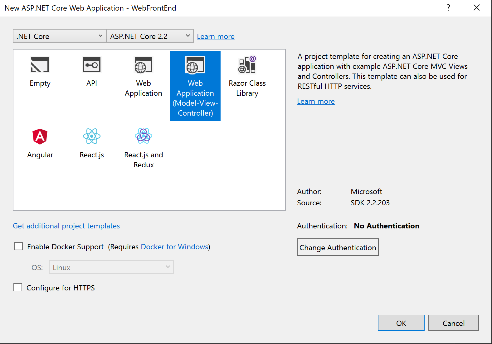
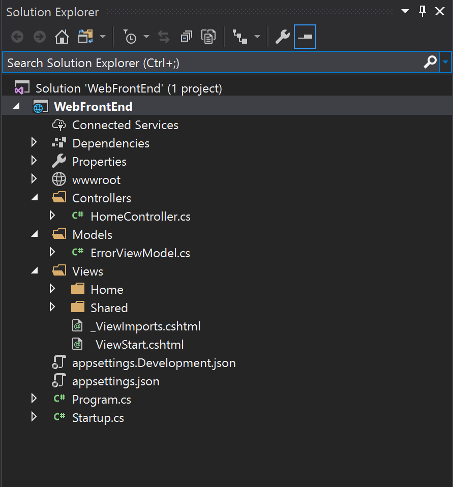
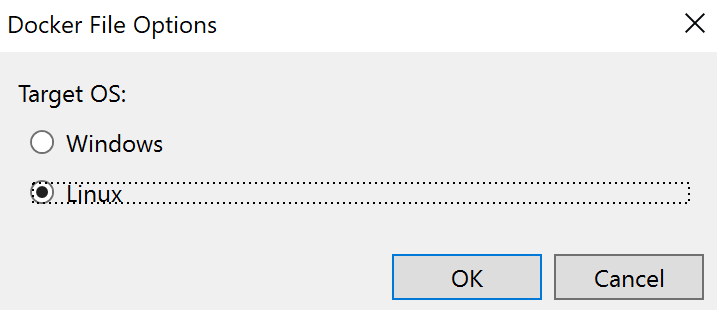
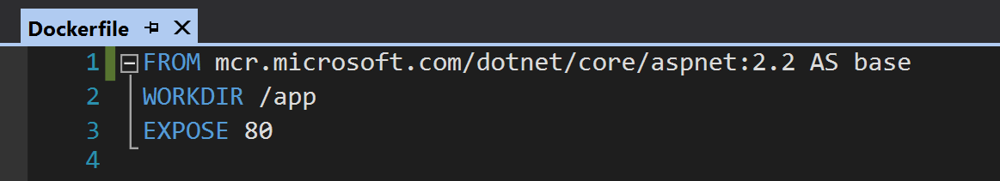
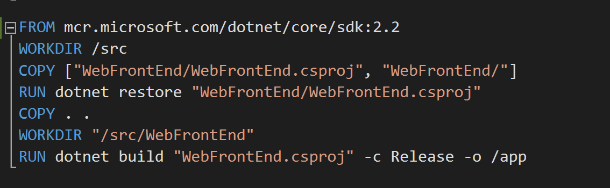
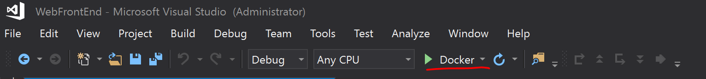

# Visual Studio Docker Tooling Labs

## Overview 
The goal of the following content is to help you get started with Docker Tooling in Visual Studio. Other links are included for you to dive deeper into Docker for Windows and working with Docker in VS Code

## Prerequisites

- [Windows 10 Professional or Enterprise with Anniversary Update (version 1607) or later](https://code.visualstudio.com/Download)
- Hyper-V enabled
-  [Visual Studio 2017 (v 15.7 or later) or Visual Studio 2019](https://visualstudio.microsoft.com/downloads/)
- [Docker Desktop for Windows](https://docs.docker.com/docker-for-windows/install/)
-  [Visual Studio Code](https://code.visualstudio.com/Download)
- [Latest .NET Core 2.2 SDK](https://dotnet.microsoft.com/download)

## Getting Started with Visual Studio 

1.  Open Visual Studio 2017 and use `Ctrl+Shift+N` to open the New Project dialogue  
   
2.  Create a new Visual C#, ASP.NET Core Web Application and name it `WebFrontEnd`. Click 'OK' to continue.
    
    
   
3. Configure your project to use `.NET Core`, the `ASP.NET Core 2.2 SDK` and the `Web Application (Model-View-Controller)` template. You will notice you can select `Enable Docker Support` when creating a new project. In this lab, we will be adding Docker Support at a later time, but keep in mind you can leverage this feature in the future to add Docker Support during project creation. Click 'OK' to create.
   
   **Note: For this lab, we will not configure for HTTPS.**
   
    

4. Open the Solution Explorer using `Ctrl+Alt+L` to view your project files. Your output should mirror the image below. 
   
   

5. Use `F5` or `Ctrl+F5` to run your project and confirm it is working as expected.
    
    >*Now for the fun stuff*! Once you have confirmed that your application is running locally, you can get started with Docker tools for Visual Studio

## Adding Docker Support in Visual Studio
**Important: Before continuing with the lab, ensure Docker For Desktop is in Linux-mode.** To confirm you are in Linux-mode, use the following steps:
1. Right-click the Docker Desktop icon located in the lower right-hand corner of your taskbar
2. If you are in Linux-mode already, you will see `Switch to Windows containers`. Otherwise, you will need to select `Switch to Linux containers`.
    > This switch will tell Docker Desktop to use the MobyLinuxVM in Hyper-V to run Linux containers. You can view this VM by opening `Hyper-V Manager`. 
    
    

3. Once you have confirmed you are in Linux-Mode, return to Visual Studio. Right-click your `WebFrontEnd` project in the Solution Explorer, select `Add` from the menu and then proceed to select `Docker Support`. You will then be prompted to select a target operating system: Windows or Linux. Select `Linux` and then click 'OK' to continue.

    > Note: .NET Core is cross-platform, therefore the `WebFrontEnd` application can run on Windows and Linux. You can adapt the lab instructions to target Windows if you desire.
   
   

4. After adding Docker Support, validate that a `Dockerfile` was added to the `WebFrontEnd` project.
   
   > This lab assumes prior experience with Dockerfiles. If you would like to learn more about Dockerfiles, check out the following resources: 
   > - [Dockerfile Reference Documentation by Docker](https://docs.docker.com/engine/reference/builder/)
   > - [.NET and multi-stage Dockerfiles by Steve Lasker](https://blogs.msdn.microsoft.com/stevelasker/2017/09/11/net-and-multistage-dockerfiles/)

    **Recently, Microsoft changed the hosting location for Microsoft .NET Core container images. This change is not yet reflected in the auto-generated Dockerfile. Therefore, we will update it manually to adhere to best practices. For more information on the Microsoft Container Registry:**
   
   > - [Microsoft syndicates container catalog by Steve Lasker](https://azure.microsoft.com/en-us/blog/microsoft-syndicates-container-catalog/)
   > - [.NET Core Container Images now Published to Microsoft Container Registry by Richard Lander](https://devblogs.microsoft.com/dotnet/net-core-container-images-now-published-to-microsoft-container-registry/)

5. Modify the initial `FROM` statement in the Dockerfile to use the MCR hosted ASP.NET Core Runtime image: `mcr.microsoft.com/dotnet/core/aspnet:2.2`. 
   
   

6. Modify the `FROM` statement on `line 5` in the Dockerfile to use the MCR hosted .NET Core SDK image: `mcr.microsoft.com/dotnet/core/sdk:2.2`. 

    

7. Now, you can use `F5` or `Ctrl+F5` to run your application in a Docker container!
   
    

    >Note: With Docker Support, you can debug your application as if it is running locally! To see this in action, place a breakpoint on line 15 in `HomeController.cs` and refresh the application homepage!

8. With your Containerized Docker application running in Visual Studio, open a Command Prompt window. Run the `docker ps` command to view the running container via the Docker CLI. 
   
   

## Working with Docker in Visual Studio Code

