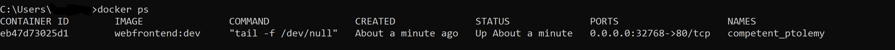
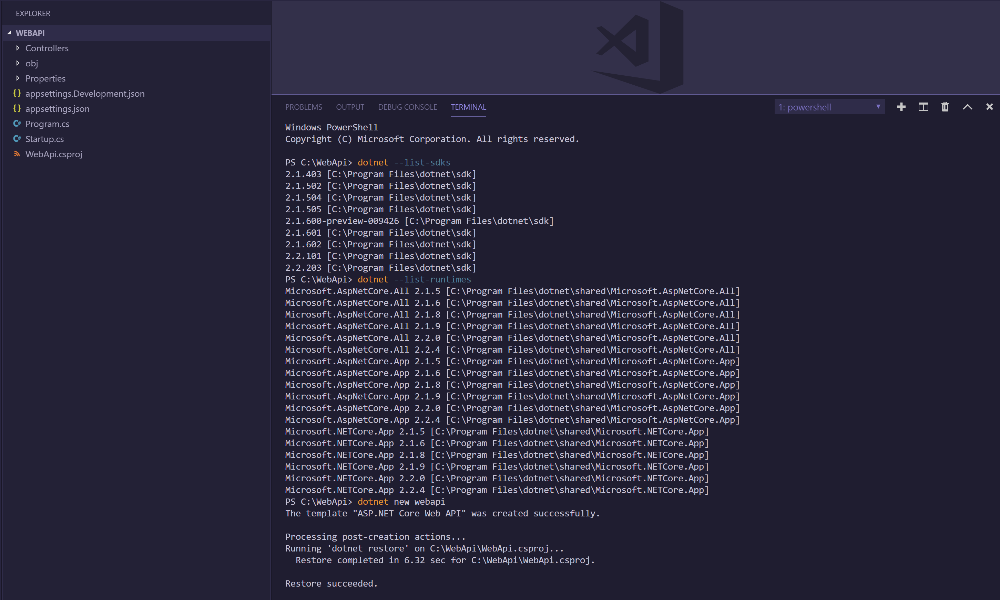
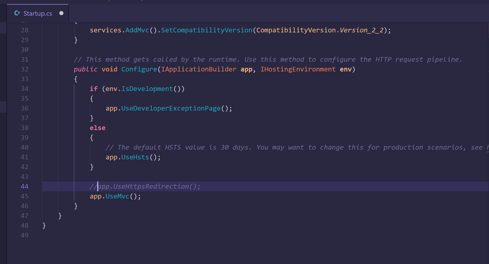
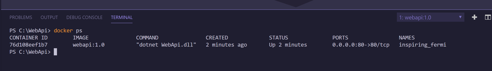
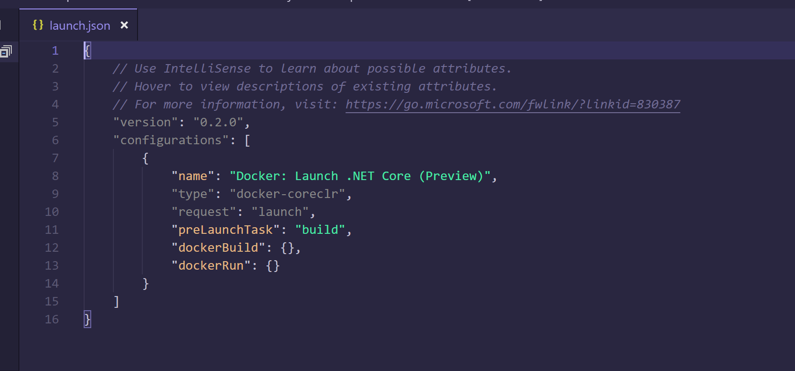

# Introductino to Visual Studio and VS Code Docker Tooling

## Overview 
The goal of the following content is to help you leverage the power of Visual Studio and Visual Studio Code as you develop with Docker

## Prerequisites

- [Windows 10 Professional or Enterprise with Anniversary Update (version 1607) or later](https://code.visualstudio.com/Download)
- Hyper-V enabled
-  [Visual Studio 2017 (v 15.7 or later) or Visual Studio 2019](https://visualstudio.microsoft.com/downloads/)
- [Docker Desktop for Windows](https://docs.docker.com/docker-for-windows/install/)
-  [Visual Studio Code](https://code.visualstudio.com/Download)
   -  [Docker Extension for VS Code](https://marketplace.visualstudio.com/items?itemName=PeterJausovec.vscode-docker)
- [Latest .NET Core 2.2 SDK](https://dotnet.microsoft.com/download)

## Getting Started with Visual Studio 

1.  Open Visual Studio 2017 and use `Ctrl+Shift+N` to open the New Project dialogue  
   
2.  Create a new Visual C#, ASP.NET Core Web Application and name it `WebFrontEnd`. Click 'OK' to continue.
    
    
   
3. Configure your project to use `.NET Core`, the `ASP.NET Core 2.2 SDK` and the `Web Application (Model-View-Controller)` template. You will notice you can select `Enable Docker Support` when creating a new project. In this lab, we will be adding Docker Support at a later time, but keep in mind you can leverage this feature in the future to add Docker Support during project creation. Click 'OK' to create.
   
   **Note: For this lab, we will not configure for HTTPS.**
   
    

4. Open the Solution Explorer using `Ctrl+Alt+L` to view your project files. Your output should mirror the image below. 
   
   

5. Use `F5` or `Ctrl+F5` to run your project and confirm it is working as expected.
    
    >*Now for the fun stuff*! Once you have confirmed that your application is running locally, you can get started with Docker tools for Visual Studio

### Adding Docker Support in Visual Studio
**Important: Before continuing with the lab, ensure Docker For Desktop is in Linux-mode.** To confirm you are in Linux-mode, use the following steps:
1. Right-click the Docker Desktop icon located in the lower right-hand corner of your taskbar
2. If you are in Linux-mode already, you will see `Switch to Windows containers`. Otherwise, you will need to select `Switch to Linux containers`.
    > This switch will tell Docker Desktop to use the MobyLinuxVM in Hyper-V to run Linux containers. You can view this VM by opening `Hyper-V Manager`. 
    
    

3. Once you have confirmed you are in Linux-Mode, return to Visual Studio. Right-click your `WebFrontEnd` project in the Solution Explorer, select `Add` from the menu and then proceed to select `Docker Support`. You will then be prompted to select a target operating system: Windows or Linux. Select `Linux` and then click 'OK' to continue.

    > Note: .NET Core is cross-platform, therefore the `WebFrontEnd` application can run on Windows and Linux. You can adapt the lab instructions to target Windows if you desire.
   
   

4. After adding Docker Support, validate that a `Dockerfile` was added to the `WebFrontEnd` project.
   
   > This lab assumes prior experience with Dockerfiles. If you would like to learn more about Dockerfiles, check out the following resources: 
   > - [Dockerfile Reference Documentation by Docker](https://docs.docker.com/engine/reference/builder/)
   > - [.NET and multi-stage Dockerfiles by Steve Lasker](https://blogs.msdn.microsoft.com/stevelasker/2017/09/11/net-and-multistage-dockerfiles/)
   > - [Multi-stage Dockerfiles by Dan Clarke](https://www.danclarke.com/multistage-dockerfiles)

    **Recently, Microsoft changed the hosting location for Microsoft .NET Core container images. This change is not yet reflected in the auto-generated Dockerfile. Therefore, we will update it manually to adhere to best practices. For more information on the Microsoft Container Registry:**
   
   > - [Microsoft syndicates container catalog by Steve Lasker](https://azure.microsoft.com/en-us/blog/microsoft-syndicates-container-catalog/)
   > - [.NET Core Container Images now Published to Microsoft Container Registry by Richard Lander](https://devblogs.microsoft.com/dotnet/net-core-container-images-now-published-to-microsoft-container-registry/)

5. Modify the initial `FROM` statement in the Dockerfile to use the MCR hosted ASP.NET Core Runtime image: `mcr.microsoft.com/dotnet/core/aspnet:2.2`. 
   
   

6. Modify the `FROM` statement on `line 5` in the Dockerfile to use the MCR hosted .NET Core SDK image: `mcr.microsoft.com/dotnet/core/sdk:2.2`. 

    

7. Now, you can use `F5` or `Ctrl+F5` to run your application in a Docker container!
   
    

    >Note: With Docker Support, you can debug your application as if it is running locally! To see this in action, place a breakpoint on line 15 in `HomeController.cs` and refresh the application homepage!

8. With your Containerized Docker application running in Visual Studio, open a Command Prompt window. Run the `docker ps` command to view the running container via the Docker CLI. 
   
   

9. **For the sake of not recreating the wheel, reference the following documentation to access hands-on-labs for working with multicontainer applications, container orchestators, Azure Dev Spaces and more. 
   - [Container Tools in Visual Studio](https://docs.microsoft.com/en-us/visualstudio/containers/?view=vs-2017)
   - [Azure Dev Spaces in Visual Studio and VS Code](https://docs.microsoft.com/en-us/azure/dev-spaces/)
   - 

## Working with Docker in Visual Studio Code

### Create a new project 
1. Open a New Visual Studio Code window and use `Ctrl+K Ctrl+O` to open the File Explorer
   
2. Create a new folder called `WebApi` and open the folder in VS Code
   
3. Toggle the Terminal using `` Ctrl+` `` and run `dotnet --list-sdks` to ensure you have the latest .NET Core SDK (2.2.203 as of April 2019). If you need to download the latest version, click [here](https://dotnet.microsoft.com/download)

4. Once you have confirmed your SDK version, use the `dotnet --list-runtimes` command to confirm you have the latest .NET Core Runtime (2.2.4 as of April 2019)

    **Note: If you have the .NET Core 3.0 preview installed, run `dotnet new globaljson --sdk-version 2.2.203` to ensure your Web Api project targets the .NET Core 2.2 SDK**
 
5. Create a new .NET Core Web Api project by running the following command `dotnet new webapi` 
   
    

6. Once your project has been created, navigate to the `Startup.cs` and use `Ctrl+K Ctrl+C` to comment out line 44.  If you would like to learn more HTTPS with Docker and .NET Core, leverage the following sources: 
   - https://mikewilliams.io/net-core-2-1-and-docker-how-to-get-docker-to-recognize-a-local-ssl-certificate-6e637e1e8800)
   - https://devblogs.microsoft.com/dotnet/using-net-and-docker-together-dockercon-2018-update/

    

7. Test out the application by running `dotnet run` in the Terminal window and navigating to http://localhost:5000/api/values or https://localhost:5001/api/values. To stop the application, return to the terminal and `Ctrl+C`

### Working with the Docker Extension in Visual Studio
1. Now, it's time to generate a Dockerfile. Using VS Code and the Docker Extension, we can `Ctrl+Shift+P` and type in `Docker:Add Docker Files to Workspace`. *For ASP.NET Core applications, docker-compose files are not automatically generated*. Enter the below information to build the Dockerfile:
    - Application Platform: ASP.NET Core
    - OS: Linux
    - Port: 80 
    
    **Remember: The Dockerfile generated should be viewed as a starting place. You may have to make modifications as you develop your custom solution. Use the built-in Dockerfile syntax support to your advantage!**

2. Once the Dockerfile has been added to your Workspace, you can leverage it to build your container image. **Don't forget to update the Dockerfile with the new MCR-hosted base OS images**. To build an image, you can do any of the following: 
    - Work with the Docker CLI in the Terminal to run a `docker build -f "Dockerfile" -t webapi:1.0` (For more information on tagging your images, click [here](https://docs.docker.com/engine/reference/commandline/tag/))
    - Right-click the Dockerfile and select `Build Image`
    - `Ctrl+Shift+P` and type `Docker:Build Image`

3.  To confirm your image was built successfully, you can run the `docker images` command, or you can leverage the Docker:Explorer view in VS Code. Navigate to the Docker Explorer by selecting the Docker icon in the left-hand Activity Bar

    >The Docker Explorer comes with the Docker Extension and allows you to interact with your images, containers and registries in a UI-driven fashion
   
4.  Now that you have created a container image for the application, you can leverage that image to create containers. To run a container in VS Code: 
	- Work with the Docker CLI in the Terminal to run a `docker run` command targeting the `webapi:1.0` image
	- Right-click the image in Docker Explorer and select `Run`
	- `Ctrl+Shift+P` and type `Docker: Run`
	
5. Now, you should confirm your container is up and running using one of the following methods:
    - Run `docker ps` in the VS Code Terminal to view all running containers
    - Check for the container under the `Containers` section in the Docker Explorer
    - Navigate to http://localhost:80/api/values (You may have mapped a different port on localhost to the container, you can check this in the "PORTS" column after running `docker ps`) 
    
    

    >Note: The Docker Extension includes "-rm" by default when executing a `docker run` command. This means if there is an issue with the main process in the container and the process exits, the container will be removed. This makes troubleshooting extremely difficult. If your container did not appear after running `docker ps`, rerun the `docker run` command without the `-rm` flag. This will allow you to view the failed container using `docker ps -a`. You can then use `docker logs` to view the container logs for troubleshooting

6. Now that you have confirmed your application is up and running in the container, you will want to configure container debugging in VS Code. You can navigate to the Debug window using `Ctrl+Shift+D`
   
7. To add the necessary Debug Configuration, select `Add Configuration` from the Debug drop-down menu and then right-click on the Launch.json tool icon. Select `Docker:Launch .NET Core (Preview)`. While the auto-generated json should be enough to begin debugging, you may want to override default dockerBuild and dockerRun settings as you dig deeper

    

8. **For the sake of not recreating the wheel, reference the following documentation [Container Tools in Visual Studio](https://docs.microsoft.com/en-us/visualstudio/containers/?view=vs-2017)

## Additional Resources and Hands-on-Labs 
   
   - [Microsoft Cloud Workshop- Containers and DevOps](https://github.com/Microsoft/MCW-Containers-and-DevOps) 
   - [Docker classroom](https://training.play-with-docker.com/)
   - [Docker Support on Windows 10 and Windows Server 2016](https://devblogs.microsoft.com/premier-developer/demystifying-docker-containers-support-on-windows-10-and-windows-server-2016/)
   - [Dockerizing a Node.js web app](https://nodejs.org/en/docs/guides/nodejs-docker-webapp/)
   - [Docker Containers on Windows Server 2019](https://computingforgeeks.com/how-to-run-docker-containers-on-windows-server-2019/)
   - [Docker Labs](https://docs.docker.com/samples/)
   - [Docker Cheat Sheet](https://github.com/wsargent/docker-cheat-sheet#why-docker)
   - [Awesome Docker: A curated list of Docker resources and project](https://github.com/veggiemonk/awesome-docker)
   - [Docker Images for working with .NET Core](https://github.com/dotnet/dotnet-docker)
   - [Docker web series](https://goto.docker.com/2019_AMER-Docker-Enterprise-Webinar-Series.html?utm=email)
   - [Containers Overview by Mark Russinovich](https://azure.microsoft.com/en-us/blog/containers-docker-windows-and-trends/)
   - [Getting a shell in Docker for Windows Moby VM](https://www.bretfisher.com/getting-a-shell-in-the-docker-for-windows-vm/)
   - [Docker Logging Design and Best Practices](https://success.docker.com/article/logging-best-practices#introduction)
   - [Build, test and push Docker container apps](https://docs.microsoft.com/en-us/azure/devops/pipelines/languages/docker?view=azure-devops&tabs=designer&viewFallbackFrom=vsts)
   - [VS Code for Docker/Kubernetes](https://devblogs.microsoft.com/premier-developer/why-you-should-consider-vs-code-for-your-kubernetes-docker-work/)
   - [Working with multiple projects in VS Code](https://code.visualstudio.com/docs/editor/multi-root-workspaces)
   - [VS Code Tips and Tricks](https://code.visualstudio.com/docs/getstarted/tips-and-tricks)
   - [VS Code for C++ Development](https://devblogs.microsoft.com/cppblog/using-vs-code-for-c-development-with-containers/)

   - [Container 101 EBook](https://puppet.com/resources/ebook/geek-guide-containers-101)
   - [Architecture for Containerized .NET Application](https://docs.microsoft.com/enus/dotnet/standard/microservices-architecture/)
   - [A reference implementation demonstrating microservices architecture and best practices for Microsoft Azure](https://github.com/mspnp/microservices-reference-implementation)
   - [Containerize your apps with Docker and Kubernetes](https://azure.microsoft.com/en-us/resources/containerize-your-apps-with-docker-and-kubernetes/) 
   - [Kubernetes Learning Path](https://azure.microsoft.com/mediahandler/files/resourcefiles/kubernetes-learning-path/Kubernetes%20Learning%20Path%20v4.pdf)
   - [Azure Kubernetes Service Lab](https://aksworkshop.io/)
   - [Operational Best Practices for AKS](https://www.youtube.com/watch?v=RJJ4CUyja6M)
   - [Kubernetes classroom](https://training.play-with-kubernetes.com/kubernetes-workshop/)
   - [AKS Best Practices](https://docs.microsoft.com/en-us/azure/aks/best-practices)
   - [Kubernetes the hard way on Azure](https://github.com/ivanfioravanti/kubernetes-the-hard-way-on-azure)
   - [Basic Tutorials for Kubernetes](https://kubernetes.io/docs/tutorials/kubernetes-basics/) 
   - [Persisting state in Kubernetes](https://www.youtube.com/watch?v=-Va5FWnY2iI )
   - [Securing a Kubernetes Cluster](https://kubernetes.io/docs/tasks/administer-cluster/securing-a-cluster/)
   - [Kubernetes with Helm](https://docs.bitnami.com/kubernetes/how-to/deploy-application-kubernetes-helm/)   
   -  [Kubernetes Bootcamp](https://kubernetesbootcamp.github.io/kubernetes-bootcamp/)
   - [Helm Getting Started](https://helm.sh/docs/)
   - [Discover and launch great Kubernetes ready apps](https://hub.kubeapps.com/)
   - [AKS DevOps Lab](https://github.com/heoelri/container-bootcamp/blob/master/labs/day2-labs/cicd-vsts.md)
   - [Kubernetes Security Guide](https://sysdig.lookbookhq.com/c/pf-kubernetes-security-guide?mkt_tok=eyJpIjoiT1RFNVltWmhZV0l3TURJMSIsInQiOiJRZzJodEMxdmQ0N2tLcCtEWjNlZmNBQ3VpSDhaY05meVBTT0huQ04ydXRRajNydjNaak1ydjlWZEw2ZkIyUDFLdm9DZGhKRlJ2QVBTamQrOHFSTnNQcWZJQUxIczRDRkVJVVlvOXZGcEFIcXZqS0lrN242REp1U3o1MDRYeGhmUCJ9&utm_medium=email&utm_source=secure-nurture&x=TThUsG)
  - [Kubernetes Hackfest](https://github.com/Azure/kubernetes-hackfest)
  - [Emerging Orchestration Trends](https://www.datadoghq.com/pdf/ContainerOrchestration2018.pdf)
  - [Recommended Kubernetes Tutorials](https://www.aquasec.com/wiki/display/containers/70+Best+Kubernetes+Tutorials#id-70BestKubernetesTutorials-helm)
 
